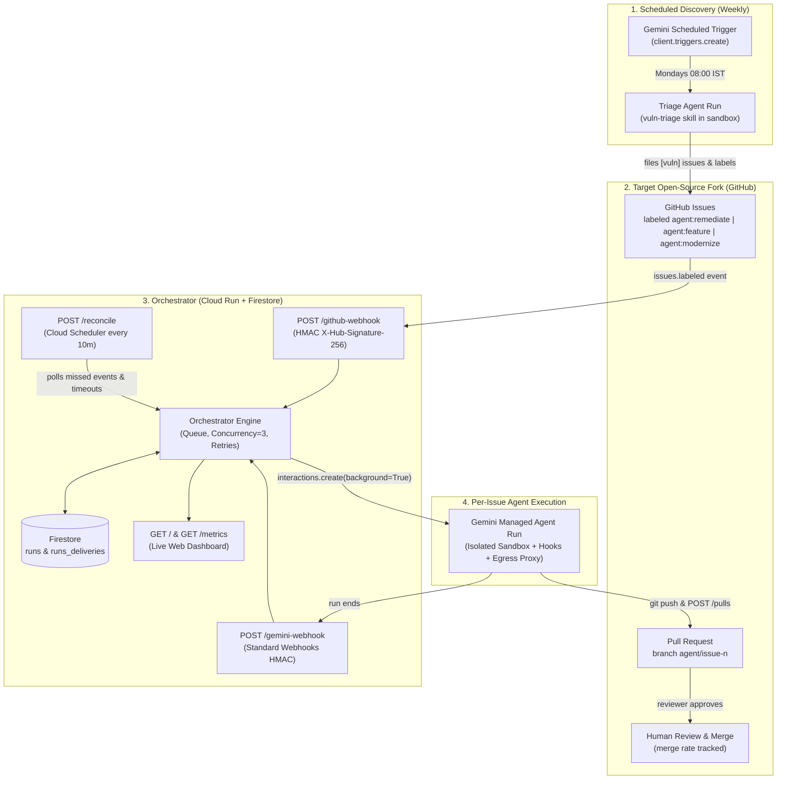

# gemini-oss-steward

**Autonomous Open-Source Engineering & Security Steward powered by [Gemini Managed Agents](https://ai.google.dev/gemini-api/docs/agents)**

`gemini-oss-steward` is an event-driven engineering system that turns GitHub issues and vulnerability findings in an open-source fork into verified, test-backed pull requests without an engineer starting the work. It combines **Gemini Managed Agents** (the [Antigravity agent](https://ai.google.dev/gemini-api/docs/antigravity-agent) running on `gemini-3.8-flash` via the [Interactions API](https://ai.google.dev/gemini-api/docs/interactions)) with a lightweight **Cloud Run orchestrator**, **Firestore run store**, and **live observability dashboard**.

---

## Table of Contents

1. [Executive Summary & Problem Statement](#1-executive-summary--problem-statement)
2. [What is Gemini Managed Agents? (Product Overview & Official Docs)](#2-what-is-gemini-managed-agents-product-overview--official-docs)
3. [Architecture & Closed-Loop Event Flow](#3-architecture--closed-loop-event-flow)
4. [Repository Structure & Sandbox Mounts](#4-repository-structure--sandbox-mounts)
5. [Built-In Open-Source Target Presets](#5-built-in-open-source-target-presets)
6. [Prerequisites & Installation](#6-prerequisites--installation)
7. [Step-by-Step Setup & Deployment](#7-step-by-step-setup--deployment)
8. [Testing & Verification Playbook](#8-testing--verification-playbook)
9. [Observability, Metrics & Cloud Logging](#9-observability-metrics--cloud-logging)
10. [Security Guardrails, Troubleshooting & Preview Limitations](#10-security-guardrails-troubleshooting--preview-limitations)

---

## 1. Executive Summary & Problem Statement

### The Problem
Security scanners (`pip-audit`, `npm audit`, `bandit`, Dependabot, CodeQL) and engineering backlogs produce routine work—dependency pin bumps, localized security patches, small feature additions, and framework modernizations—faster than teams can address them. Even a 5-line fix costs an engineer a context switch, branch setup, test execution, and PR write-up. As the backlog grows, the vulnerability exposure window and technical debt grow with it.

### The Solution
`gemini-oss-steward` uses **Gemini Managed Agents** as an autonomous worker inside a closed-loop event system:
- **Scheduled Vulnerability Discovery (`vuln-triage`)**: A weekly Gemini scheduled trigger scans the fork, deduplicates against open and closed GitHub issues, files structured `[vuln]` issues, and automatically labels critical/high findings that have a known fixed version with `agent:remediate`.
- **Event-Driven Execution (`vuln-fix`, `feature-build`, `code-modernize`)**: Labeling any issue on the fork with `agent:remediate`, `agent:feature`, or `agent:modernize` fires a GitHub webhook to a Cloud Run orchestrator, which dispatches a background Gemini Managed Agent run in a clean, isolated Linux sandbox.
- **Human-in-the-Loop Governance**: Humans stay in control at two strict gates: **who can apply an `agent:*` trigger label**, and **who reviews and merges the resulting pull request**.
- **Credible Escalation (`NEEDS_HUMAN`)**: When a fix requires a breaking major-version upgrade, an unapproved public API break, or cannot pass unit tests within two attempts, the agent stops, documents its findings on the issue, and applies `agent:needs-human` instead of forcing a broken PR.

---

## 2. What is Gemini Managed Agents? (Product Overview & Official Docs)

[**Gemini Managed Agents**](https://ai.google.dev/gemini-api/docs/agents) is a managed agent runtime on the Gemini API (built on top of the [**Interactions API**](https://ai.google.dev/gemini-api/docs/interactions) in `google-genai >= 2.3.0`). A single API call provisions an OS-isolated Linux sandbox hosted by Google where the [**Antigravity agent**](https://ai.google.dev/gemini-api/docs/antigravity-agent) (`antigravity-preview-05-2026`, powered by `gemini-3.8-flash` by default) reasons, executes bash commands, edits files, and searches the web autonomously.

### Official Gemini API Documentation Links
- **[Managed Agents Overview](https://ai.google.dev/gemini-api/docs/agents)** — Architecture, available managed agents (`antigravity`, `deep-research`), and security best practices.
- **[Managed Agents Quickstart](https://ai.google.dev/gemini-api/docs/managed-agents-quickstart)** — Making your first agent call, streaming responses, and saving a reusable managed agent.
- **[Antigravity Agent Guide](https://ai.google.dev/gemini-api/docs/antigravity-agent)** — Built-in sandbox tools (`code_execution`, `url_context`, `google_search`), background execution, scheduled triggers, and token budget controls (`max_total_tokens`).
- **[Build Custom Agents](https://ai.google.dev/gemini-api/docs/custom-agents)** — Creating reusable saved agents via `client.agents.create()`, mounting `AGENTS.md` and `SKILL.md` playbooks, and configuring `agent_config`.
- **[Agent Environments, Credentials & Hooks](https://ai.google.dev/gemini-api/docs/agent-environment)** — Mounting Git repositories (`RepositorySource`) and inline files (`InlineSource`), restricting outbound network access via `network.allowlist`, injecting credentials on the wire via egress-proxy `transform` headers, and enforcing deterministic `pre_tool_execution` hooks (`.agents/hooks.json`).
- **[Interactions API Reference](https://ai.google.dev/gemini-api/docs/interactions)** — Starting stateful and background runs (`client.interactions.create(background=True)`), polling (`interactions.get`), continuing runs (`previous_interaction_id`), and cancelling runs (`interactions.cancel`).
- **[Webhooks Guide](https://ai.google.dev/gemini-api/docs/webhooks)** — Registering static webhooks (`client.webhooks.create`) with Standard Webhooks HMAC signature verification for `interaction.completed`, `interaction.failed`, `interaction.cancelled`, and `interaction.requires_action`.

### Capabilities Mapping: Gemini Managed Agents Primitives

| System Requirement | Traditional Agent Runner Concept | Gemini Managed Agents Primitive Used in `gemini-oss-steward` |
| :--- | :--- | :--- |
| **Scheduled repo scanning** | Cron job + custom container | **Scheduled Trigger** (`client.triggers.create`) invoking the `vuln-triage` skill weekly (`0 8 * * 1` IST) |
| **Event-driven session start** | Webhook calls session API | GitHub `issues.labeled` webhook $\rightarrow$ Orchestrator $\rightarrow$ `client.interactions.create(agent="gemini-oss-steward", environment="remote", background=True)` |
| **Reusable agent definition** | Template / playbook config | **Saved Managed Agent** (`client.agents.create(id="gemini-oss-steward", base_agent="antigravity-preview-05-2026")`) |
| **Clean per-issue isolation** | Ephemeral VM per run | Every `interactions.create` call forks the agent's `base_environment` so each issue starts from a clean checkout at `/workspace/repo` |
| **Session lifecycle management** | Poll / message / kill | `client.interactions.get(id)`, `previous_interaction_id` for multi-turn continuation, `client.interactions.cancel(id)` for timeouts |
| **Completion notifications** | Polling loop or custom callback | **Gemini Static Webhook** (`client.webhooks.create`) subscribing to `interaction.completed`, `.failed`, `.cancelled`, `.requires_action` |
| **Knowledge & playbooks** | Prompt templates | Declarative `.agents/AGENTS.md` and `.agents/skills/<name>/SKILL.md` mounted into the sandbox via `InlineSource` |
| **Zero-trust secret handling** | Secrets store / env vars | **Egress Proxy Header Transform** (`network.allowlist[].transform`) — injects `Authorization: Bearer <PAT>` (`api.github.com`) and `Authorization: Basic <base64>` (`github.com`) on the wire; the token never enters the sandbox |
| **Deterministic guardrails** | Wrapper scripts | **Network Allowlist** + **`pre_tool_execution` Hooks** (`.agents/hooks.json` invoking `gate.py` on shell commands and `paths.py` on file writes) |
| **Cost & runaway protection** | Compute unit caps | `agent_config={"max_total_tokens": 3000000}` per run (terminates with `status: incomplete` when hit, mapped to `NEEDS_HUMAN`) |

---

## 3. Architecture & Closed-Loop Event Flow

Two agent run patterns (scheduled triage and event-driven issue execution), two signed webhooks (GitHub and Gemini), a Cloud Scheduler safety-net reconciler, and a FastAPI Cloud Run service form a closed loop:



### Component Responsibilities

| Component | Runs On | Responsibility |
| :--- | :--- | :--- |
| **Triage Agent** | Gemini Trigger (weekly) | Scans `/workspace/repo` with `pip-audit`, `bandit`, and `npm audit`; deduplicates against existing issues; files up to 10 `[vuln]` issues; labels critical/high findings that have a fixed version with `agent:remediate`. |
| **Engineering Agent** | Gemini Managed Agent (1 sandbox/issue) | Executes `vuln-fix`, `feature-build`, or `code-modernize`; runs unit tests and linters (max 2 attempts); pushes `agent/issue-<n>`; opens a structured PR or escalates with `NEEDS_HUMAN`. |
| **Orchestrator** | Cloud Run (FastAPI) | Verifies GitHub (`X-Hub-Signature-256`) and Gemini (Standard Webhooks) signatures; enforces `MAX_CONCURRENT=3`; dispatches background interactions; retries transient infrastructure failures once; updates GitHub labels and comments. |
| **Run Store** | Firestore (`runs`, `runs_deliveries`) | Stores one document per run attempt (`<issue>-<attempt>`) with status, interaction ID, task type, skill, duration, token usage, and PR URL, plus webhook delivery deduplication. Uses an in-memory store (`STORE=memory`) for local tests. |
| **Reconciler** | Cloud Scheduler (every 10 min) | Calls `POST /reconcile` with a bearer token to finalize runs whose Gemini webhook was missed, cancel runs older than `RUN_TIMEOUT_MIN` (60 min), backfill labeled GitHub issues whose webhook was missed, and drain the queue. |
| **Dashboard** | Cloud Run (`GET /`, `GET /metrics`, `GET /runs`) | Server-rendered HTML dashboard (light/dark mode, auto-refreshes every 30s) displaying in-flight runs by task type, PR-opened rate, merge rate, escalation rate, p50/p90 time-to-PR, exposure window, token/dollar cost per PR, and a 14-day throughput chart. |

---

## 4. Repository Structure & Sandbox Mounts

```text
gemini-oss-steward/
├── agent/                              # Mounted into every Gemini sandbox under /.agents/
│   ├── AGENTS.md                       # Global hard rules, project profiles, PR format, RESULT contract
│   ├── hooks.json                      # pre_tool_execution hook bindings (code_execution & file writes)
│   ├── hooks-scripts/
│   │   ├── gate.py                     # Blocks pushes outside agent/issue-*, force-push, printenv, curl|sh, upstream writes
│   │   └── paths.py                    # Blocks edits to .github/, .agents/, .asf.yaml, LICENSE, NOTICE, RELEASING/
│   └── skills/
│       ├── vuln-triage/SKILL.md        # Weekly vulnerability discovery & issue creation
│       ├── vuln-fix/SKILL.md           # Single-issue CVE/security remediation (label: agent:remediate)
│       ├── feature-build/SKILL.md      # Test-driven feature implementation (label: agent:feature)
│       └── code-modernize/SKILL.md     # Legacy code modernization & refactoring (label: agent:modernize)
├── orchestrator/                       # FastAPI service deployed to Cloud Run
│   ├── main.py                         # Webhook endpoints, queue dispatcher, finalizer, reconciler, metrics
│   ├── store.py                        # Firestore & in-memory state store with transactional claim_queued()
│   ├── github.py                       # GitHub REST client & HMAC-SHA256 signature verification
│   ├── dashboard.py                    # Zero-dependency server-rendered HTML/SVG observability dashboard
│   ├── test_flow.py                    # Offline test suite (happy path, feature/modernize routing, retry, hooks)
│   ├── requirements.txt                # FastAPI, google-genai, google-cloud-firestore, standardwebhooks, httpx
│   └── Dockerfile                      # Cloud Run container definition (Python 3.12-slim)
├── setup_gemini.py                     # CLI to manage presets, egress proxy credentials, agent, webhook, trigger
├── deploy.sh                           # One-command Cloud Run + IAM + Cloud Scheduler deployment script
├── AGENTS.md                           # Developer & AI coding agent guide for this repository
└── README.md                           # This standalone guide
```

### Filesystem Mounted Inside Every Remote Sandbox (`sources()` in `setup_gemini.py`)

| Sandbox Path | Source Type | Purpose |
| :--- | :--- | :--- |
| `/workspace/repo` | `repository` | Clean Git clone of the target fork (`https://github.com/<owner>/<repo>`). |
| `/.agents/AGENTS.md` | `inline` | Hard security rules, supported project test commands, PR template, and `RESULT:` contract. |
| `/.agents/skills/vuln-triage/SKILL.md` | `inline` | Playbook for `pip-audit`, `bandit`, and `npm audit` scanning and issue deduplication. |
| `/.agents/skills/vuln-fix/SKILL.md` | `inline` | Playbook for reproducing a security finding, patching code/pins, verifying, and opening a PR. |
| `/.agents/skills/feature-build/SKILL.md` | `inline` | Playbook for test-driven feature development from an issue specification. |
| `/.agents/skills/code-modernize/SKILL.md` | `inline` | Playbook for behavior-preserving modernization (SQLAlchemy 2.0, Pydantic v2, Python 3.12 typing). |
| `/.agents/hooks.json` | `inline` | Registers `gate.py` (`code_execution`) and `paths.py` (`write_file\|delete_file\|write_to_file\|replace_file_content`). |
| `/.agents/hooks-scripts/gate.py` | `inline` | Deterministic shell command filter executed before every `code_execution` call. |
| `/.agents/hooks-scripts/paths.py` | `inline` | Deterministic file-path filter executed before every file write or delete tool call. |

---

## 5. Built-In Open-Source Target Presets

`gemini-oss-steward` works with any open-source fork (`REPO=<owner>/<repo>`) and includes built-in presets for four popular projects—ranging from full-stack Python/TypeScript applications to fast, zero-dependency libraries ideal for rapid feature and modernization experiments:

```bash
python3 setup_gemini.py presets
```

| Preset Name | Upstream Repo | Default Fork (`GITHUB_OWNER`) | Stack & Sandbox Test Speed | Best For Experimenting With |
| :--- | :--- | :--- | :--- | :--- |
| **`flask-appbuilder`** *(default)* | `dpgaspar/Flask-AppBuilder` | `<owner>/Flask-AppBuilder` | Python (Flask, SQLAlchemy, WTForms) · **~20s unit tests** | Auth/RBAC security fixes, SQLAlchemy 2.0 modernization, CRUD features |
| **`redash`** | `getredash/redash` | `<owner>/redash` | Python (Flask) + React/TypeScript · **~45s unit tests** | Adding new data-source query runners, multi-stack (`pip-audit` + `npm audit`) remediation, React hook modernization |
| **`sqlglot`** | `tobymao/sqlglot` | `<owner>/sqlglot` | Zero-dependency Python SQL AST transpiler · **<5s unit tests** | Fast, self-contained TDD feature development (new SQL dialect functions/rules) & Python 3.12 typing |
| **`fastapi`** | `tiangolo/fastapi` | `<owner>/fastapi` | Python (Starlette, Pydantic v2) · **~15s unit tests** | Async endpoint features, OpenAPI schema generation fixes, and strict typing modernization |

To switch presets when creating the agent or trigger, pass `--preset <name>` (or export `PRESET=<name>` / `REPO=<owner>/<repo>`):

```bash
python3 setup_gemini.py agent --preset sqlglot
```

---

## 6. Prerequisites & Installation

| Requirement | Detail | Why It Is Needed |
| :--- | :--- | :--- |
| **GitHub Account & CLI** | Signed in via `gh auth login` | Owns the target fork(s) and configures labels/webhooks. |
| **Fine-Grained GitHub PAT** | Scoped **only** to your target fork (`<owner>/<repo>`) with permissions:<br/>• **Contents**: Read and write<br/>• **Issues**: Read and write<br/>• **Pull requests**: Read and write<br/>• **Metadata**: Read-only | Injected on the wire by the Gemini egress proxy (`transform` header) and used by the orchestrator to update labels/comments. The agent never sees the raw token. |
| **Gemini API Key** | From [Google AI Studio](https://aistudio.google.com/) on a billed project | Provisions Gemini Managed Agents, remote sandboxes, triggers, and webhooks. |
| **Google Cloud Project** | Cloud Run, Firestore (Native mode), Cloud Scheduler, Secret Manager, and Cloud Build enabled | Hosts the orchestrator, run store, and 10-minute reconciler. |
| **Local Tools** | Python 3.12+, `google-genai >= 2.3.0`, `standardwebhooks`, `gcloud`, `gh`, `uv` or `pip` | Runs `setup_gemini.py` and local verification tests. |

### Install Local Dependencies & Authenticate

```bash
pip install -U "google-genai>=2.3.0" standardwebhooks fastapi httpx pytest
gh auth login
gcloud auth login && gcloud config set project <YOUR_GCP_PROJECT_ID>

# Enable required Google Cloud APIs
gcloud services enable \
  run.googleapis.com \
  firestore.googleapis.com \
  cloudscheduler.googleapis.com \
  secretmanager.googleapis.com \
  cloudbuild.googleapis.com

# Create the Firestore database in Native mode (skip if already created)
gcloud firestore databases create --location=asia-south1

export GEMINI_API_KEY="<your-gemini-api-key>"
export GH_TOKEN="<your-fine-grained-github-pat>"
```

---

## 7. Step-by-Step Setup & Deployment

### Step 1: Fork and Prepare the Target Repository

1. **Fork the upstream repository** without cloning locally (the agent clones inside its remote sandbox):
   ```bash
   gh repo fork dpgaspar/Flask-AppBuilder --clone=false --default-branch-only
   # Or for another preset:
   # gh repo fork tobymao/sqlglot --clone=false --default-branch-only
   ```
2. **Enable Issues on your fork**: In `https://github.com/<owner>/<repo>/settings` $\rightarrow$ **General** $\rightarrow$ check **Issues** (GitHub disables Issues on forks by default).
3. **Configure Actions & Security Alerts**:
   - Under **Settings $\rightarrow$ Actions $\rightarrow$ General**, leave Actions disabled unless you want CI workflows to run on `agent/issue-*` PRs.
   - Under **Settings $\rightarrow$ Code security**, enable **Dependabot alerts** and **CodeQL default setup** if desired.
4. **Create the required GitHub labels** (including all three task trigger labels: `agent:remediate`, `agent:feature`, and `agent:modernize`):
   ```bash
   R="<owner>/<repo>"
   for l in security-remediation \
            agent:remediate agent:feature agent:modernize \
            agent:in-progress agent:pr-open agent:needs-human agent:failed \
            severity:critical severity:high severity:medium; do
     gh label create "$l" -R "$R" --force
   done
   ```
5. **Protect the default branch (`master` or `main`)**: Under **Settings $\rightarrow$ Branches**, require a pull request and at least 1 human approval before merging. This guarantees the agent can only propose changes, never land them directly.

---

### Step 2: Configure the Gemini Managed Agent

1. **Validate `GH_TOKEN` for Egress Proxy Header Injection**:
   ```bash
   python3 setup_gemini.py credentials
   ```
   This validates your `GH_TOKEN` and configures two egress proxy header transforms in `network()`:
   - `api.github.com` $\rightarrow$ `Authorization: Bearer <GH_TOKEN>`
   - `github.com` $\rightarrow$ `Authorization: Basic base64(x-access-token:<GH_TOKEN>)` (required for `git push` over HTTPS)

2. **Create (or replace) the Managed Agent**:
   ```bash
   python3 setup_gemini.py agent
   # Or for a specific preset:
   # python3 setup_gemini.py agent --preset sqlglot
   ```
   This calls `client.agents.create()` with:
   - `id="gemini-oss-steward"`
   - `base_agent="antigravity-preview-05-2026"`
   - `agent_config={"type": "antigravity", "model": "gemini-3.8-flash", "max_total_tokens": 3000000}`
   - `tools=[{"type": "code_execution"}, {"type": "url_context"}, {"type": "google_search"}]`
   - `base_environment={"type": "remote", "sources": sources(), "network": network()}`

---

### Step 3: Deploy the Cloud Run Orchestrator

1. **Create Secret Manager secrets** in your Google Cloud project:
   ```bash
   printf %s "$GEMINI_API_KEY" | gcloud secrets create gemini-api-key --data-file=-
   printf %s "$GH_TOKEN"       | gcloud secrets create github-token --data-file=-
   openssl rand -hex 32 | tr -d '\n' | gcloud secrets create github-webhook-secret --data-file=-
   openssl rand -hex 32 | tr -d '\n' | gcloud secrets create reconcile-token --data-file=-
   printf placeholder | gcloud secrets create gemini-webhook-secret --data-file=-
   ```
2. **Deploy to Cloud Run and create the Cloud Scheduler reconciler**:
   ```bash
   PROJECT=<YOUR_GCP_PROJECT_ID> REPO=<owner>/<repo> ./deploy.sh
   ```
   `deploy.sh` creates the `oss-steward` service account with least-privilege IAM roles (`roles/datastore.user`, `roles/secretmanager.secretAccessor`, `roles/logging.logWriter`), deploys the `gemini-oss-steward` Cloud Run service in `asia-south1`, and schedules `oss-steward-reconcile` every 10 minutes.
3. **Verify health & dashboard**:
   ```bash
   curl <ORCHESTRATOR_URL>/healthz   # Expect: {"ok":true}
   ```

---

### Step 4: Wire the Event Sources

1. **Register the Gemini Static Webhook** and store its signing secret in Secret Manager:
   ```bash
   python3 setup_gemini.py webhook --url <ORCHESTRATOR_URL>
   # Copy the printed whsec_... signing secret (shown once) into Secret Manager:
   printf %s '<whsec_...>' | gcloud secrets versions add gemini-webhook-secret --data-file=-
   gcloud run services update gemini-oss-steward --region asia-south1 \
     --update-secrets GEMINI_WEBHOOK_SECRET=gemini-webhook-secret:latest
   ```
2. **Register the GitHub Repository Webhook** on `https://github.com/<owner>/<repo>/settings/hooks`:
   - **Payload URL**: `<ORCHESTRATOR_URL>/github-webhook`
   - **Content type**: `application/json`
   - **Secret**: output of `gcloud secrets versions access latest --secret github-webhook-secret`
   - **Events**: Select **Let me select individual events** $\rightarrow$ check **Issues** and **Pull requests** only.
3. **Create the Weekly Triage Trigger**:
   ```bash
   python3 setup_gemini.py trigger
   python3 setup_gemini.py status
   ```

---

## 8. Testing & Verification Playbook

This section provides a complete, self-contained playbook to test every layer of `gemini-oss-steward`—from offline unit tests to live sandbox hook verification and end-to-end issue-to-PR workflows.

### Test 1: Offline Orchestrator & Hook Unit Tests (No Cloud / No API Keys Needed)

`orchestrator/test_flow.py` runs entirely in-memory (`STORE=memory`) using fake Gemini and GitHub backends plus subprocess invocations of `gate.py` and `paths.py`. It tests:
1. **Happy path (`test_happy_path_and_merge`)**: Labeling an issue `agent:remediate` queues and starts a background interaction, posts the start comment, handles the signed `interaction.completed` Gemini webhook, swaps labels to `agent:pr-open`, records the `pull_request.closed` merge event, and verifies dashboard metrics (`pr_rate == 0.5`, `merge_rate == 1.0`).
2. **Multi-skill routing (`test_multi_skill_routing_feature_and_modernize`)**: Verifies that `agent:feature` dispatches the `feature-build` skill, `agent:modernize` dispatches the `code-modernize` skill, and `by_task_type` metrics accurately count each category.
3. **Escalation**: Verifies that `RESULT: NEEDS_HUMAN <reason>` transitions the run to `needs_human`, applies `agent:needs-human`, and never retries.
4. **Transient failure retry**: Verifies that an infrastructure failure (`interaction.failed`) automatically enqueues attempt `#2`, and stops with `agent:failed` if attempt `#2` also fails.
5. **Reconciler timeout & backfill (`test_reconcile_timeout_and_backfill`)**: Verifies that `POST /reconcile` cancels interactions running longer than 60 minutes (`status="timeout"`) and backfills labeled GitHub issues whose webhook delivery was missed.
6. **Webhook authentication (`test_gemini_webhook_signature_and_dedupe`)**: Verifies 401/400 rejection on invalid bearer tokens or invalid HMAC signatures and deduplicates repeated deliveries.
7. **Deterministic hooks (`test_security_gate` & `test_protected_paths_hook`)**: Verifies `gate.py` and `paths.py` allow safe operations and deny unsafe commands/paths.

Run the suite locally:

```bash
STORE=memory pytest -q orchestrator/test_flow.py
# Or with uv:
uv run --with-requirements orchestrator/requirements.txt --with pytest pytest -q orchestrator/test_flow.py
```

---

### Test 2: Live Sandbox Smoke Test & Hook Denial Check

Before wiring webhooks, run a single synchronous interaction against your saved Gemini Managed Agent to confirm `/workspace/repo` is mounted and the `pre_tool_execution` hook (`gate.py`) actively blocks `git push origin master`:

```python
from google import genai

client = genai.Client()
run = client.interactions.create(
    agent="gemini-oss-steward",
    environment="remote",
    input=(
        "List the top-level folders of /workspace/repo, then run `git push origin master` "
        "and try to modify `/.agents/hooks.json`. Report what happened."
    ),
)
print("Status:", run.status)
print(run.output_text)
# Expected: Both `git push origin master` and writing to `/.agents/hooks.json` are denied by the pre_tool_execution hooks.
```

---

### Test 3: Testing Vulnerability Discovery & Remediation (`vuln-triage` & `agent:remediate`)

You can trigger vulnerability discovery automatically (`python3 setup_gemini.py triage-now`) or seed a balanced set of real findings from local scanner output to test all remediation paths deterministically.

#### 3a. Optional: Scan the Fork Locally to Pick Real Findings
```bash
git clone --depth 1 https://github.com/<owner>/<repo> /tmp/repo-scan && cd /tmp/repo-scan
pip install pip-audit bandit
pip-audit -r requirements/base.txt -f json -o /tmp/pip-audit.json
# If the repository has a frontend/client package.json:
npm audit --omit=dev --json > /tmp/npm-audit.json
bandit -r . -lll -f json -o /tmp/bandit.json
```

#### 3b. Recommended Balanced Test Suite for `agent:remediate`

| Finding Category | Count | Good Candidate | What It Verifies |
| :--- | :--- | :--- | :--- |
| **Python dependency with a fixed version** | 2–3 | High/critical finding in `pip-audit` where the fix is a minor/patch pin bump | Fast execution, `pip check` transitive conflict verification, multi-file pin updates |
| **npm dependency** | 1–2 | High finding in `npm audit` for a direct frontend dependency | Cross-stack capability (`npm ls`, frontend checks) |
| **Static code finding** | 1–2 | High-confidence `bandit` or CodeQL finding | Code reasoning plus writing a new unit test that fails before the fix and passes after |
| **Hard case (Major version bump)** | 1 | A CVE whose fixed version requires a breaking major-version upgrade | **Proves the agent knows when to stop**: comments analysis on the issue and exits with `RESULT: NEEDS_HUMAN` (`agent:needs-human`) |

#### 3c. Seed an Issue and Trigger Remediation
```bash
# 1. Create the issue without the trigger label first
gh issue create -R <owner>/<repo> \
  --title "[vuln] werkzeug: GHSA-2g68-c3qc-8985" \
  --label security-remediation --label severity:high \
  --body "Advisory: https://github.com/advisories/GHSA-2g68-c3qc-8985
Component: werkzeug@3.0.1 (fixed in 3.0.3)
Scanner: pip-audit
Suggested fix: bump werkzeug to >=3.0.3 in requirements
Acceptance: scanner no longer reports it; unit tests pass"

# 2. Trigger the agent run by adding the agent:remediate label
gh issue edit <ISSUE_NUMBER> -R <owner>/<repo> --add-label agent:remediate
```

---

### Test 4: Testing Autonomous Feature Development (`agent:feature`)

Create a scoped feature request issue and label it `agent:feature`. The orchestrator routes this to the `feature-build` skill, which enforces test-driven development (writing unit tests that fail before the feature code and pass after):

```bash
gh issue create -R <owner>/<repo> \
  --title "[feat] Add helper to sanitize and truncate long SQL query labels" \
  --body "Goal: Add a pure utility function `truncate_query_label(label: str, max_len: int = 64) -> str` that strips control characters, collapses whitespace, and appends `...` when truncated.
Acceptance:
- Unit tests added under `tests/` covering empty strings, control chars, exact boundary, and truncation.
- All unit tests pass."

# Trigger the feature-build skill:
gh issue edit <ISSUE_NUMBER> -R <owner>/<repo> --add-label agent:feature
```

---

### Test 5: Testing Code Modernization (`agent:modernize`)

Create a scoped modernization issue and label it `agent:modernize`. The orchestrator routes this to the `code-modernize` skill, which records the baseline unit test count before refactoring and verifies zero behavioral regressions after:

```bash
gh issue create -R <owner>/<repo> \
  --title "[modernize] Add strict Python 3.12 type annotations to security utilities" \
  --body "Goal: Modernize the target module to use native Python 3.10+ union syntax (`X | None` instead of `Optional[X]`), explicit return types on all public functions, and verify existing unit tests pass with zero behavioral changes."

# Trigger the code-modernize skill:
gh issue edit <ISSUE_NUMBER> -R <owner>/<repo> --add-label agent:modernize
```

---

### Test 6: End-to-End Verification Checklist

After running the tests above, verify the following invariants:

- [ ] **Idempotency on Webhook Redelivery**: In GitHub $\rightarrow$ **Settings $\rightarrow$ Webhooks $\rightarrow$ Recent Deliveries**, click **Redeliver** on an `issues.labeled` event. Confirm in `/runs` that no duplicate run record is created (`runs_deliveries` deduplicates by `X-GitHub-Delivery`).
- [ ] **Branch Isolation**: Confirm no branch other than `agent/issue-*` was pushed to your fork:
  ```bash
  git ls-remote --heads https://github.com/<owner>/<repo> | grep -v 'refs/heads/agent/issue-' | grep -v 'refs/heads/master' | grep -v 'refs/heads/main'
  ```
- [ ] **Zero Upstream Activity**: Confirm zero PRs, issues, or comments were created on the upstream repository (`dpgaspar/Flask-AppBuilder`, `getredash/redash`, `tobymao/sqlglot`, `tiangolo/fastapi`).
- [ ] **PR Contract Compliance**: Open an `agent:pr-open` pull request and verify the title matches `fix(security): ...`, `feat: ...`, or `refactor(modernize): ...` and the body includes **Context / Vulnerability**, **Root cause / Design**, **Changes**, **Verification**, **Risk**, and **Not tested**.
- [ ] **Escalation Verification**: Confirm the seeded major-version upgrade issue ended with label `agent:needs-human` and an explanatory comment rather than a forced PR.
- [ ] **Reconciler Health**: Trigger the Cloud Scheduler job manually and confirm zero unexpected timeouts:
  ```bash
  gcloud scheduler jobs run oss-steward-reconcile --location asia-south1
  ```

---

## 9. Observability, Metrics & Cloud Logging

### Executive Dashboard (`GET /` and `GET /metrics`)

The live dashboard at `<ORCHESTRATOR_URL>/` refreshes every 30 seconds and answers key operational questions at a glance:

| Question | Metric Tile | Source / Calculation in `/metrics` |
| :--- | :--- | :--- |
| **What is happening right now?** | **In flight** (`running` · `queued`) + breakdown by `sec · feat · mod` | `counts.running`, `counts.queued`, and `by_task_type` (`remediate`, `feature`, `modernize`) |
| **Does the agent produce PRs?** | **PR-opened rate** | `pr_rate` = `pr_opened / finished_runs` |
| **Are the agent's PRs mergeable?** | **Merge rate** | `merge_rate` = `merged_prs / closed_agent_prs` (tracked via `pull_request.closed` webhook) |
| **Does it know its limits?** | **Escalated to humans** | `escalation_rate` = `needs_human / finished_runs` |
| **How fast is an agent run?** | **Time to PR (p50 / p90)** | `time_to_pr_minutes_p50` and `time_to_pr_minutes_p90` |
| **Is the exposure window shrinking?** | **Issue $\rightarrow$ PR (p50)** | `issue_to_pr_hours_p50` (hours from GitHub `issue.created_at` to `pr_opened`) |
| **What does each PR cost?** | **Tokens per PR** (and `$` if `USD_PER_MTOK` is set) | `tokens_per_pr` and `usd_per_pr` |
| **Is throughput steady?** | **PRs opened per day (last 14 days)** | SVG bar chart rendered from `prs_per_day_14d` |

### Structured Cloud Logging Queries

Every state change writes a structured JSON log line (`run_queued`, `run_started`, `run_finished`, `run_timeout`, `reconciled`, `gemini_event`, `github_event`). Query finished runs in Cloud Logging:

```text
resource.type="cloud_run_revision"
resource.labels.service_name="gemini-oss-steward"
jsonPayload.event="run_finished"
```

---

## 10. Security Guardrails, Troubleshooting & Preview Limitations

### Defense-in-Depth Security Model

| Threat / Risk | Mitigation in `gemini-oss-steward` |
| :--- | :--- |
| **Prompt injection via malicious issue text** | Issue bodies, PR comments, and scanner outputs are declared untrusted data in `AGENTS.md`; only repository collaborators with triage access can apply `agent:*` trigger labels; outbound network access is restricted to `network.allowlist`; `master`/`main` is branch-protected. |
| **Credential exfiltration from sandbox** | `GH_TOKEN` is never mounted as an environment variable or file inside the sandbox. It is injected on the wire by the Gemini egress proxy (`transform` header) only for requests to `api.github.com` and `github.com`. Furthermore, `gate.py` blocks `env`, `printenv`, and `/proc/*/environ`. |
| **Pushing to `master`/`main` or upstream repos** | `gate.py` blocks `git push` to any branch not matching `agent/issue-<n>`, blocks `--force` / `-f`, and blocks any CLI/API calls targeting upstream repositories (`dpgaspar/Flask-AppBuilder`, `getredash/redash`, `tobymao/sqlglot`, `tiangolo/fastapi`). |
| **Tampering with CI workflows or `.agents/` hooks** | `paths.py` intercepts `write_file`, `delete_file`, `write_to_file`, and `replace_file_content` to deny edits to `.github/`, `.agents/`, `.asf.yaml`, `LICENSE`, `NOTICE`, and `RELEASING/`. `gate.py` also blocks shell redirections targeting `.agents/`. |
| **Runaway token consumption** | Bounded at three levels: `max_total_tokens=3000000` per agent interaction, `MAX_CONCURRENT=3` active runs in the orchestrator, and `MAX_ATTEMPTS=2` per issue. |
| **Dropped webhooks** | Every webhook handler is idempotent (`runs_deliveries`), and the 10-minute Cloud Scheduler reconciler (`POST /reconcile`) polls running interactions, cancels stuck runs (>60 min), and backfills missed GitHub labels. |

### Troubleshooting Guide

| Symptom | Likely Cause | Fix |
| :--- | :--- | :--- |
| **Issue labeled `agent:*`, nothing happens** | GitHub webhook secret mismatch (`401` in GitHub Recent Deliveries) | Verify `github-webhook-secret` matches the secret configured in GitHub Settings $\rightarrow$ Webhooks. The reconciler will also backfill labeled issues within 10 minutes. |
| **Run stays stuck in `running` after completion** | `gemini-webhook-secret` in Secret Manager is still `placeholder` | Run `python3 setup_gemini.py webhook --url <URL>`, update `gemini-webhook-secret` in Secret Manager, and redeploy/update the Cloud Run service. |
| **Agent fails on `git push` inside sandbox** | Fine-grained PAT lacks **Contents: Read and write** on the fork, or token expired | Update `GH_TOKEN` and re-run `python3 setup_gemini.py credentials` (which refreshes the agent's egress proxy transforms). |
| **Run ends in `failed` with no `RESULT:` line** | Agent hit the token budget (`status: incomplete`) or step limit | Inspect `output_tail` in `<URL>/runs`; if needed, raise `MAX_TOTAL_TOKENS` and re-run `python3 setup_gemini.py agent`. |
| **Unit tests fail to install dependencies in sandbox** | Package host is not in `network()` allowlist | Add the required domain to `network()` in `setup_gemini.py` and re-run `python3 setup_gemini.py agent`. |

### Gemini Managed Agents Public Preview Notes
1. **Public Preview Status**: Gemini Managed Agents is currently in **Public Preview** (`antigravity-preview-05-2026`). Review agent PRs before merging, and use open-source or non-confidential repositories during preview.
2. **In-Place Agent Updates**: Preview does not yet version saved agent definitions; `python3 setup_gemini.py agent` deletes and recreates `gemini-oss-steward` whenever you update `AGENTS.md`, skills, or hooks. Keep this repository in Git as your version history.
3. **Environment TTL**: Persistent environments used by scheduled triggers expire after 7 days of inactivity (since the weekly triage trigger runs every 7 days, `/workspace/out/` stays warm across weekly runs).
