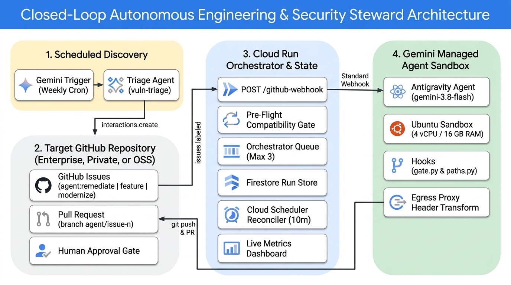
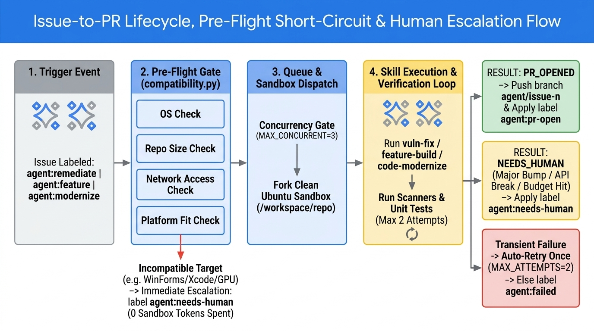
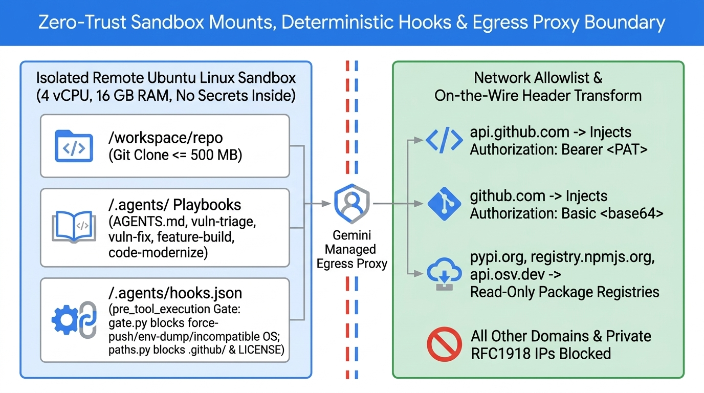
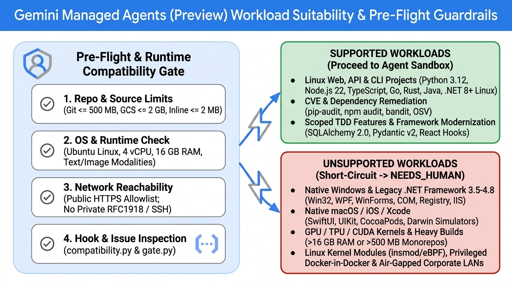

# gemini-code-guru

**Autonomous Software Engineering, Modernization & Security Platform for Any Repository (Enterprise, Private, Commercial, or Open-Source) — powered by [Gemini Managed Agents](https://ai.google.dev/gemini-api/docs/agents)**

> [!WARNING]
> **Public Preview Disclaimer**: [**Gemini Managed Agents**](https://ai.google.dev/gemini-api/docs/agents) (`antigravity-preview-05-2026`), [**Agent Environments**](https://ai.google.dev/gemini-api/docs/agent-environment), [**Agent Hooks**](https://ai.google.dev/gemini-api/docs/agent-hooks), **Scheduled Triggers**, and **Static Webhooks** are currently in **Public Preview** (`/v1beta/`) and are **subject to change**. API schemas, pre-installed sandbox packages, resource allocations (currently 4 vCPU / 16 GB RAM), source size limits, and pricing may evolve prior to General Availability (GA). Always consult the **[Official Gemini Managed Agents Documentation](https://ai.google.dev/gemini-api/docs/agents)** and the **[Gemini API Changelog](https://ai.google.dev/gemini-api/docs/changelog)** for the latest specifications.

`gemini-code-guru` is an event-driven autonomous engineering and security remediation platform that turns GitHub issues and vulnerability findings in **any compatible software repository**—whether a private enterprise microservice, a commercial product repository, or an open-source fork—into verified, test-backed pull requests without an engineer starting the work.

It combines **Gemini Managed Agents** (the [Antigravity agent](https://ai.google.dev/gemini-api/docs/antigravity-agent) running on `gemini-3.8-flash` via the [Interactions API](https://ai.google.dev/gemini-api/docs/interactions)) with a **Pre-Flight Compatibility Gate**, a **Cloud Run orchestrator**, a **Firestore run store**, and a **live observability dashboard**.



---

## Table of Contents

1. [Executive Summary & Universal Repository Scope](#1-executive-summary--universal-repository-scope)
2. [What is Gemini Managed Agents? (Product Overview & Official Docs)](#2-what-is-gemini-managed-agents-product-overview--official-docs)
3. [Architecture, Closed-Loop Event Flow & Issue Lifecycle](#3-architecture-closed-loop-event-flow--issue-lifecycle)
4. [Repository Structure, Zero-Trust Sandbox Mounts & Security Boundary](#4-repository-structure-zero-trust-sandbox-mounts--security-boundary)
5. [Target Repository Modes & Built-In Reference Presets](#5-target-repository-modes--built-in-reference-presets)
6. [Gemini Managed Agents Suitability, Limitations & Built-In Guardrails (Preview)](#6-gemini-managed-agents-suitability-limitations--built-in-guardrails-preview)
7. [Prerequisites & Installation](#7-prerequisites--installation)
8. [Step-by-Step Setup & Deployment](#8-step-by-step-setup--deployment)
9. [Testing & Verification Playbook](#9-testing--verification-playbook)
10. [Observability, Metrics & Cloud Logging](#10-observability-metrics--cloud-logging)
11. [Defense-in-Depth Security & Troubleshooting](#11-defense-in-depth-security--troubleshooting)

---

## 1. Executive Summary & Universal Repository Scope

### The Problem
Across private enterprise repositories, commercial SaaS codebases, and open-source projects alike, security scanners (`pip-audit`, `npm audit`, `bandit`, Dependabot, CodeQL) and engineering backlogs produce routine work—dependency pin bumps, localized security patches, small feature additions, and framework modernizations—faster than teams can address them. Even a 5-line change costs an engineer a context switch, branch setup, test execution, and PR write-up. As the backlog grows, the vulnerability exposure window and technical debt grow with it.

### The Solution: Universal Autonomous Engineering with `gemini-code-guru`
`gemini-code-guru` uses **Gemini Managed Agents** as an autonomous software engineer inside a closed-loop event system that works with **any Linux-compatible GitHub repository**:
- **Works on Any Project (`--repo <owner>/<repo>`)**:
  - **Private Enterprise & Commercial Repositories (Direct Mode)**: Point `gemini-code-guru` at any internal or commercial repository (`REPO=my-org/payments-api`). The agent clones the repo into an isolated Ubuntu sandbox, runs tests, pushes `agent/issue-<n>` branches, and opens PRs directly against your protected `main`/`master` branch.
  - **Open-Source Repositories (Fork Mode)**: Point `gemini-code-guru` at your fork (`REPO=<you>/<oss-fork>`) or use one of the 4 built-in presets (`flask-appbuilder`, `redash`, `sqlglot`, `fastapi`). Deterministic hooks (`gate.py`) additionally prevent any accidental traffic to upstream OSS repositories.
- **Scheduled Vulnerability Discovery (`vuln-triage`)**: A weekly Gemini scheduled trigger scans the target repository, deduplicates against open and closed GitHub issues, files structured `[vuln]` issues, and automatically labels critical/high findings that have a known fixed version with `agent:remediate`.
- **Event-Driven Execution (`vuln-fix`, `feature-build`, `code-modernize`)**: Labeling any issue with `agent:remediate`, `agent:feature`, or `agent:modernize` fires a GitHub webhook to the Cloud Run orchestrator, which runs a **Pre-Flight Compatibility Check** and dispatches a background Gemini Managed Agent run in a clean, isolated Linux sandbox.
- **Proactive Checks & Balances (Fail-Fast Guardrails)**: Rather than letting teams discover Gemini Managed Agents sandbox limitations the hard way (after burning millions of tokens on a native Windows `.NET Framework` desktop app, an Xcode iOS build, or a GPU kernel), `orchestrator/compatibility.py` and `setup_gemini.py check` validate both the repository and every incoming issue before a sandbox is ever provisioned.
- **Human-in-the-Loop Governance**: Humans stay in control at two strict gates: **who can apply an `agent:*` trigger label**, and **who reviews and merges the resulting pull request**.

---

## 2. What is Gemini Managed Agents? (Product Overview & Official Docs)

[**Gemini Managed Agents**](https://ai.google.dev/gemini-api/docs/agents) is a managed agent runtime on the Gemini API (built on top of the [**Interactions API**](https://ai.google.dev/gemini-api/docs/interactions) in `google-genai >= 2.3.0`). A single API call provisions an OS-isolated Ubuntu Linux sandbox hosted by Google where the [**Antigravity agent**](https://ai.google.dev/gemini-api/docs/antigravity-agent) (`antigravity-preview-05-2026`, powered by `gemini-3.8-flash` by default) reasons, executes bash commands, edits files, and searches the web autonomously.

### Official Gemini API Documentation Links (Public Preview)
- **[Managed Agents Overview](https://ai.google.dev/gemini-api/docs/agents)** — Architecture, available managed agents (`antigravity`, `deep-research`), security best practices, and high-level limits.
- **[Managed Agents Quickstart](https://ai.google.dev/gemini-api/docs/managed-agents-quickstart)** — Making your first agent call, streaming responses, and saving a reusable managed agent.
- **[Antigravity Agent Guide](https://ai.google.dev/gemini-api/docs/antigravity-agent)** — Built-in sandbox tools (`code_execution`, `url_context`, `google_search`), background execution, scheduled triggers, and token budget controls (`max_total_tokens`).
- **[Build Custom Agents](https://ai.google.dev/gemini-api/docs/custom-agents)** — Creating reusable saved agents via `client.agents.create()`, mounting `AGENTS.md` and `SKILL.md` playbooks, and configuring `agent_config`.
- **[Agent Environments, Pre-Installed Software & Limitations](https://ai.google.dev/gemini-api/docs/agent-environment)** — Mounting Git repositories (`RepositorySource` <= 500 MB), GCS buckets (`<= 2 GB`), and inline files (`InlineSource` <= 2 MB total), 4 vCPU / 16 GB RAM resource specs, restricting outbound network access via `network.allowlist`, and injecting credentials via egress-proxy `transform` headers.
- **[Agent Hooks Guide](https://ai.google.dev/gemini-api/docs/agent-hooks)** — Enforcing deterministic `pre_tool_execution` and `post_tool_execution` hooks (`.agents/hooks.json`).
- **[Interactions API Reference](https://ai.google.dev/gemini-api/docs/interactions)** — Starting stateful and background runs (`client.interactions.create(background=True)`), polling (`interactions.get`), continuing runs (`previous_interaction_id`), and cancelling runs (`interactions.cancel`).
- **[Webhooks Guide](https://ai.google.dev/gemini-api/docs/webhooks)** — Registering static webhooks (`client.webhooks.create`) with Standard Webhooks HMAC signature verification.

### Capabilities Mapping: Gemini Managed Agents Primitives

| System Requirement | Traditional Agent Runner Concept | Gemini Managed Agents Primitive Used in `gemini-code-guru` |
| :--- | :--- | :--- |
| **Scheduled repo scanning** | Cron job + custom container | **Scheduled Trigger** (`client.triggers.create`) invoking the `vuln-triage` skill weekly (`0 8 * * 1` IST) |
| **Event-driven session start** | Webhook calls session API | GitHub `issues.labeled` webhook $\rightarrow$ Orchestrator Pre-Flight Gate $\rightarrow$ `client.interactions.create(agent="gemini-code-guru", environment="remote", background=True)` |
| **Reusable agent definition** | Template / playbook config | **Saved Managed Agent** (`client.agents.create(id="gemini-code-guru", base_agent="antigravity-preview-05-2026")`) |
| **Clean per-issue isolation** | Ephemeral VM per run | Every `interactions.create` call forks the agent's `base_environment` so each issue starts from a clean checkout at `/workspace/repo` |
| **Session lifecycle management** | Poll / message / kill | `client.interactions.get(id)`, `previous_interaction_id` for multi-turn continuation, `client.interactions.cancel(id)` for timeouts |
| **Completion notifications** | Polling loop or custom callback | **Gemini Static Webhook** (`client.webhooks.create`) subscribing to `interaction.completed`, `.failed`, `.cancelled`, `.requires_action` |
| **Knowledge & playbooks** | Prompt templates | Declarative `.agents/AGENTS.md` and `.agents/skills/<name>/SKILL.md` mounted into the sandbox via `InlineSource` |
| **Zero-trust secret handling** | Secrets store / env vars | **Egress Proxy Header Transform** (`network.allowlist[].transform`) — injects `Authorization: Bearer <PAT>` (`api.github.com`) and `Authorization: Basic <base64>` (`github.com`) on the wire; the token never enters the sandbox |
| **Deterministic guardrails** | Wrapper scripts | **Pre-Flight Compatibility Gate** (`compatibility.py`) + **Network Allowlist** + **`pre_tool_execution` Hooks** (`gate.py` & `paths.py`) |
| **Cost & runaway protection** | Compute unit caps | `agent_config={"max_total_tokens": 3000000}` per run (terminates with `status: incomplete` when hit, mapped to `NEEDS_HUMAN`) |

---

## 3. Architecture, Closed-Loop Event Flow & Issue Lifecycle

Two agent run patterns (scheduled triage and event-driven issue execution), a pre-flight compatibility gate, two signed webhooks (GitHub and Gemini), a Cloud Scheduler safety-net reconciler, and a FastAPI Cloud Run service form a closed loop.



### Component Responsibilities

| Component | Runs On | Responsibility |
| :--- | :--- | :--- |
| **Pre-Flight Compatibility Gate** | CLI (`setup_gemini.py check`) & Orchestrator (`compatibility.py`) | Validates repository size ($\le 500\text{ MB}$), inline sources ($\le 2\text{ MB}$), HTTPS protocol, network allowlist hostnames, project file trees, and issue descriptions. Immediately short-circuits unsupported OS/hardware workloads (e.g., native Windows/WinForms/.NET Framework 4.x, macOS/Xcode, GPU/CUDA, kernel modules) to `agent:needs-human` with **zero sandbox tokens spent**. |
| **Triage Agent** | Gemini Trigger (weekly) | Scans `/workspace/repo` with `pip-audit`, `bandit`, and `npm audit`; deduplicates against existing issues; files up to 10 `[vuln]` issues; labels critical/high findings that have a fixed version with `agent:remediate`. |
| **Engineering Agent** | Gemini Managed Agent (1 sandbox/issue) | Executes `vuln-fix`, `feature-build`, or `code-modernize`; runs unit tests and linters (max 2 attempts); pushes `agent/issue-<n>`; opens a structured PR or escalates with `NEEDS_HUMAN`. |
| **Orchestrator** | Cloud Run (FastAPI) | Verifies GitHub (`X-Hub-Signature-256`) and Gemini (Standard Webhooks) signatures; runs pre-flight issue checks; enforces `MAX_CONCURRENT=3`; dispatches background interactions; retries transient infrastructure failures once; updates GitHub labels and comments. |
| **Run Store** | Firestore (`runs`, `runs_deliveries`) | Stores one document per run attempt (`<issue>-<attempt>`) with status, interaction ID, task type, skill, pre-flight status, duration, token usage, and PR URL, plus webhook delivery deduplication. Uses an in-memory store (`STORE=memory`) for local tests. |
| **Reconciler** | Cloud Scheduler (every 10 min) | Calls `POST /reconcile` with a bearer token to finalize runs whose Gemini webhook was missed, cancel runs older than `RUN_TIMEOUT_MIN` (60 min), backfill labeled GitHub issues whose webhook was missed, and drain the queue. |
| **Dashboard** | Cloud Run (`GET /`, `GET /metrics`, `GET /runs`, `GET /compatibility`) | Server-rendered HTML dashboard (light/dark mode, auto-refreshes every 30s) displaying in-flight runs by task type, PR-opened rate, merge rate, escalation rate (including pre-flight blocks), p50/p90 time-to-PR, exposure window, token/dollar cost per PR, and a 14-day throughput chart. |

---

## 4. Repository Structure, Zero-Trust Sandbox Mounts & Security Boundary



```text
gemini-code-guru/
├── agent/                              # Mounted into every Gemini sandbox under /.agents/
│   ├── AGENTS.md                       # Global hard rules, project profiles, platform limits, PR format
│   ├── hooks.json                      # pre_tool_execution hook bindings (code_execution & file writes)
│   ├── hooks-scripts/
│   │   ├── gate.py                     # Blocks bad git push, force-push, env dump, curl|sh, Windows/Xcode/kernel tools
│   │   └── paths.py                    # Blocks edits to .github/, .agents/, .asf.yaml, LICENSE, NOTICE, RELEASING/
│   └── skills/
│       ├── vuln-triage/SKILL.md        # Weekly vulnerability discovery & issue creation
│       ├── vuln-fix/SKILL.md           # Single-issue CVE/security remediation (label: agent:remediate)
│       ├── feature-build/SKILL.md      # Test-driven feature implementation (label: agent:feature)
│       └── code-modernize/SKILL.md     # Legacy code modernization & refactoring (label: agent:modernize)
├── orchestrator/                       # FastAPI service deployed to Cloud Run
│   ├── main.py                         # Webhooks, pre-flight gate, queue dispatcher, finalizer, reconciler, metrics
│   ├── compatibility.py                # Gemini Managed Agents platform limits & repo/issue pre-flight checks
│   ├── store.py                        # Firestore & in-memory state store with transactional claim_queued()
│   ├── github.py                       # GitHub REST client & HMAC-SHA256 signature verification
│   ├── dashboard.py                    # Zero-dependency server-rendered HTML/SVG observability dashboard
│   ├── test_flow.py                    # Offline test suite (happy path, multi-skill, pre-flight gate, hooks)
│   ├── requirements.txt                # FastAPI, google-genai, google-cloud-firestore, standardwebhooks, httpx
│   └── Dockerfile                      # Cloud Run container definition (Python 3.12-slim)
├── assets/                             # High-resolution Nano Banana architecture & workflow diagrams
├── setup_gemini.py                     # CLI: presets, pre-flight check, credentials, agent, webhook, trigger
├── deploy.sh                           # One-command Cloud Run + IAM + Cloud Scheduler deployment script
├── AGENTS.md                           # Developer & AI coding agent guide for this repository
└── README.md                           # This standalone guide
```

### Filesystem Mounted Inside Every Remote Sandbox (`sources()` in `setup_gemini.py`)

| Sandbox Path | Source Type | Size Limit (Preview) | Purpose |
| :--- | :--- | :--- | :--- |
| `/workspace/repo` | `repository` | $\le 500\text{ MB}$ | Clean Git clone of the target repository (`https://github.com/<owner>/<repo>`). |
| `/.agents/AGENTS.md` | `inline` | $\le 1\text{ MB}$/file ($\le 2\text{ MB}$ total) | Hard security rules, platform compatibility rules, project test profiles, PR template, and `RESULT:` contract. |
| `/.agents/skills/vuln-triage/SKILL.md` | `inline` | $\le 1\text{ MB}$/file | Playbook for `pip-audit`, `bandit`, and `npm audit` scanning and issue deduplication. |
| `/.agents/skills/vuln-fix/SKILL.md` | `inline` | $\le 1\text{ MB}$/file | Playbook for reproducing a security finding, patching code/pins, verifying, and opening a PR. |
| `/.agents/skills/feature-build/SKILL.md` | `inline` | $\le 1\text{ MB}$/file | Playbook for test-driven feature development from an issue specification. |
| `/.agents/skills/code-modernize/SKILL.md` | `inline` | $\le 1\text{ MB}$/file | Playbook for behavior-preserving modernization (SQLAlchemy 2.0, Pydantic v2, Python 3.12 typing, React hooks). |
| `/.agents/hooks.json` | `inline` | $\le 1\text{ MB}$/file | Registers `gate.py` (`code_execution`) and `paths.py` (`write_file\|delete_file\|write_to_file\|replace_file_content`). |
| `/.agents/hooks-scripts/gate.py` | `inline` | $\le 1\text{ MB}$/file | Deterministic shell command filter executed before every `code_execution` call. |
| `/.agents/hooks-scripts/paths.py` | `inline` | $\le 1\text{ MB}$/file | Deterministic file-path filter executed before every file write or delete tool call. |

---

## 5. Target Repository Modes & Built-In Reference Presets

`gemini-code-guru` supports **any Linux-compatible GitHub repository** in two operating modes:

### Mode A: Any Private Enterprise, Commercial, or Custom Repository (`--repo <owner>/<repo>`)
Pass `--repo <owner>/<repo>` (or set `REPO=<owner>/<repo>`) to target any repository your `GH_TOKEN` has access to:

```bash
# 1. Run pre-flight compatibility checks against your repository first:
python3 setup_gemini.py check --repo acme-corp/billing-service

# 2. Create the managed agent for your repository:
python3 setup_gemini.py agent --repo acme-corp/billing-service
```

Inside `/workspace/repo`, the agent automatically detects standard Linux project manifests (`pyproject.toml`, `requirements.txt`, `package.json`, `go.mod`, `Cargo.toml`, `pom.xml`, or cross-platform `.NET 8+` `.csproj`) and runs the corresponding unit test suite.

### Mode B: Built-In Open-Source Reference Presets (`--preset <name>`)
For immediate benchmarking, demos, and evaluation, four popular open-source presets are built in:

```bash
python3 setup_gemini.py presets
```

| Preset Name | Upstream Repo | Default Target (`GITHUB_OWNER`) | Stack & Sandbox Test Speed | Best For Experimenting With |
| :--- | :--- | :--- | :--- | :--- |
| **`flask-appbuilder`** *(default)* | `dpgaspar/Flask-AppBuilder` | `<owner>/Flask-AppBuilder` | Python (Flask, SQLAlchemy, WTForms) · **~20s unit tests** | Auth/RBAC security fixes, SQLAlchemy 2.0 modernization, CRUD features |
| **`redash`** | `getredash/redash` | `<owner>/redash` | Python (Flask) + React/TypeScript · **~45s unit tests** | Adding new data-source query runners, multi-stack (`pip-audit` + `npm audit`) remediation, React hook modernization |
| **`sqlglot`** | `tobymao/sqlglot` | `<owner>/sqlglot` | Zero-dependency Python SQL AST transpiler · **<5s unit tests** | Fast, self-contained TDD feature development (new SQL dialect functions/rules) & Python 3.12 typing |
| **`fastapi`** | `tiangolo/fastapi` | `<owner>/fastapi` | Python (Starlette, Pydantic v2) · **~15s unit tests** | Async endpoint features, OpenAPI schema generation fixes, and strict typing modernization |

---

## 6. Gemini Managed Agents Suitability, Limitations & Built-In Guardrails (Preview)

> [!IMPORTANT]
> **Preview Notice**: Gemini Managed Agents is currently in **Public Preview** (`antigravity-preview-05-2026`). All specifications below reflect the current upstream documentation at **[Agent Environments & Limitations](https://ai.google.dev/gemini-api/docs/agent-environment#limitations)** and **[Managed Agents Overview](https://ai.google.dev/gemini-api/docs/agents)** and are subject to change as the platform evolves toward GA.



### 6.1 Exact Remote Sandbox Specifications & Hard Platform Limits

| Dimension | Current Preview Specification | Source / Implication |
| :--- | :--- | :--- |
| **Operating System** | **Ubuntu Linux** (OS-isolated VM) | Linux userland only; no Windows (`ntoskrnl`) or macOS (`Darwin`) kernel. |
| **CPU & Memory** | **4 CPU cores** · **16 GB RAM** (fixed allocation) | Builds or test suites exceeding 16 GB RAM will trigger the Linux OOM killer. |
| **GPU / TPU Accelerators** | **None** (CPU-only sandbox) | Cannot execute CUDA device code, GPU shader pipelines, or hardware ML training. |
| **Pre-Installed Runtimes** | **Python 3.12** (`numpy`, `pandas`, `requests`, `google-genai`, `beautifulsoup4`, `pyyaml`, `ast-grep-cli`) · **Node.js 22** (`typescript`, `create-next-app`, `create-vite`) · **UNIX/Cloud CLI** (`git`, `curl`, `wget`, `ripgrep`, `fd-find`, `jq`, `gcloud`, etc.) | Additional Linux packages can be installed at runtime via `pip install` or `npm install` if their registries are in `network.allowlist`. |
| **Git Repository Size Limit** | **500 MB** maximum (`type: "repository"`) | Repositories larger than 500 MB fail environment provisioning. |
| **Cloud Storage Source Limit** | **2 GB** maximum (`type: "gcs"`) | For large datasets mounted from `gs://` buckets. |
| **Inline Source Size Limit** | **1 MB per file** · **2 MB total** across all `InlineSource` files | All `.agents/AGENTS.md`, `SKILL.md`, and hook scripts combined must stay under 2 MB. |
| **Mount Target Constraint** | **Cannot mount at `/` (root)** | Every custom source must target a subdirectory such as `/workspace/repo` or `/.agents/...`. |
| **Native File Reader Modalities** | **Text and Image files only** | Binary file reading (`.dll`, `.exe`, `.so`, `.parquet`, `.uasset`) is not supported by the native file tool. |
| **Environment Startup & Spin-Down** | **~5 seconds** cold start; auto-spins down on inactivity | Next interaction restores filesystem state automatically with a brief cold start. |
| **Environment Lifetime (TTL)** | **7 days of inactivity** (permanent deletion) | Passing an expired `environment_id` after 7 idle days returns `404 Not Found`. |
| **Max Saved Managed Agents** | **1,000** managed agents per project; no in-place versioning yet | Updating an agent requires deleting and recreating it (`setup_gemini.py agent` handles this). |

---

### 6.2 Comprehensive Guide: Where Gemini Managed Agents Can vs. Cannot Be Used

Before onboarding a repository or labeling an issue, review the table below to understand which workloads thrive in Gemini Managed Agents and which workloads **cannot** be executed due to sandbox OS, hardware, network, or resource constraints:

| Application / Workload Category | Supported? | Detailed Technical Explanation ("Why / Why Not") |
| :--- | :--- | :--- |
| **Linux Web Backends, APIs, CLI Tools & Libraries**<br/>*(Python, Node.js/TS, Go, Rust, Java, Ruby, PHP)* | **YES (Ideal)** | Runs natively on Ubuntu Linux (4 vCPU / 16 GB RAM). Unit tests (`pytest`, `vitest`, `jest`, `go test`, `cargo test`) execute in seconds, and package managers (`pip`, `npm`) work over HTTPS allowlists. |
| **Modern Cross-Platform `.NET` (`net8.0` / `net9.0` on Linux)** | **YES (With Linux SDK)** | ASP.NET Core web APIs and class libraries targeting `net8.0` or `net9.0` without Windows-specific APIs can build and run `dotnet test` on Ubuntu Linux if `packages.microsoft.com` / `api.nuget.org` are allowlisted. |
| **Native Windows Desktop Apps & Legacy `.NET Framework 3.5–4.8` Migrations**<br/>*(WinForms, WPF, Win32, UWP, WinUI, COM/ActiveX, IIS, Windows Registry, `.vcxproj`, `.wixproj`/MSI)* | **NO — Cannot Be Used** | **Frequently Asked**: *Can Gemini Managed Agents migrate or remediate a native Windows desktop app or legacy `.NET Framework 4.x` WinForms/WPF project?* **No.** While an LLM can suggest text edits to C# files, the Ubuntu Linux sandbox **cannot run `msbuild.exe` against `.NET Framework 4.x`, cannot compile Win32/WPF/WinForms/COM interop, cannot access `HKLM`/`HKCU` Windows Registry or IIS, and cannot execute Windows UI/integration tests**. Because `gemini-code-guru` requires verified green tests before opening a PR, native Windows workloads cannot be validated in the sandbox. |
| **Native macOS, iOS, iPadOS, watchOS, tvOS & visionOS Apps**<br/>*(Xcode, `xcodebuild`, SwiftUI, UIKit, AppKit, CocoaPods)* | **NO — Cannot Be Used** | Requires the macOS Darwin kernel, Apple-signed Xcode toolchains (`xcodebuild`, `xcrun`), and iOS/macOS Simulators, none of which can run inside an Ubuntu Linux container/VM. |
| **GPU / TPU / Hardware-Accelerated ML & Graphics**<br/>*(CUDA `.cu` kernels, `nvcc` device tests, TensorRT, ROCm, DirectX/Metal/Vulkan)* | **NO — Cannot Be Used** | The remote sandbox has a fixed **4 vCPU / 16 GB RAM** allocation with **no GPU or TPU attached**. Code that requires `torch.cuda.is_available() == True`, custom CUDA kernel execution, or hardware shader rendering cannot be tested. |
| **Linux Kernel Modules, eBPF Root Programs & Privileged Docker-in-Docker**<br/>*(`insmod`, `modprobe`, `Kbuild`, `docker run --privileged`, nested KVM)* | **NO — Cannot Be Used** | For multi-tenant security, the sandbox is isolated at the OS level and blocks kernel module loading (`insmod`), privileged container capabilities (`CAP_SYS_ADMIN`), and nested hypervisors. |
| **Massive Monorepos (> 500 MB) & Memory-Heavy Compilations (> 16 GB RAM)**<br/>*(Chromium/AOSP-scale repos, Unreal/Unity game engines, large C++/Bazel links)* | **NO — Cannot Be Used** | `RepositorySource` enforces a hard **500 MB** size cap (`2 GB` for GCS sources), native file tools only inspect **text and image** files (not `.uasset`/`.dll`/`.exe` binaries), and linkers exceeding **16 GB RAM** will be OOM-killed. |
| **Air-Gapped Corporate Networks & Private VPC Dependencies**<br/>*(RFC1918 `10.x`/`192.168.x`, `.corp`/`.internal` DNS, SSH `git@...` remotes)* | **NO — Cannot Be Used** | The remote sandbox runs in Google's managed environment and connects exclusively through the Gemini HTTPS egress proxy. It has **no VPC peering or VPN tunnel** into private corporate networks and only injects credentials into HTTP/HTTPS headers (not SSH or raw TCP). |
| **Embedded Firmware & IoT Hardware-in-the-Loop**<br/>*(JTAG, ST-Link, OpenOCD, `/dev/ttyUSB*` serial, BLE hardware)* | **NO — Cannot Be Used** | Pure cross-compilation unit tests running on host x86_64 Linux can work, but any verification requiring physical USB/serial/JTAG hardware passthrough is impossible in the cloud sandbox. |

---

### 6.3 Built-In Checks & Balances (So You Never Find Out the Hard Way)

To prevent teams from wasting time and Gemini token budgets on incompatible projects or issues, `gemini-code-guru` enforces **three layers of deterministic compatibility guardrails** (`orchestrator/compatibility.py`):

#### Layer 1: Setup & CLI Pre-Flight Checker (`python3 setup_gemini.py check`)
Before creating an agent (and automatically inside `python3 setup_gemini.py agent`), the CLI validates:
1. **Repository Protocol & Mount Target**: Rejects `git@...` SSH URLs (since egress proxy `transform` headers require `https://`) and rejects root `/` mounts.
2. **Repository Size ($\le 500\text{ MB}$)**: Queries the GitHub API for repository size and blocks setup if `size > 500 MB` (warns above 350 MB).
3. **Inline Source Quotas ($\le 1\text{ MB}$/file, $\le 2\text{ MB}$ total)**: Measures byte lengths of `AGENTS.md`, all `SKILL.md` files, and hook scripts before calling `client.agents.create()`.
4. **Network Allowlist Validation**: Rejects private RFC1918 IPs (`10.x`, `192.168.x`, `172.16-31.x`), `localhost`, and `.internal`/`.corp`/`.local` domains in `network.allowlist`.
5. **Project File Tree Inspection**: Scans top-level repository files (or a local checkout via `--local-path`) for incompatible project files (`.vcxproj`, `.wixproj`, `.xcodeproj`, `.xcworkspace`, `Podfile`, `Kbuild`, or `.csproj` files containing `<TargetFrameworkVersion>v4.x` / `<UseWPF>true` / `<UseWindowsForms>true`).

```bash
# Check your repository and a sample issue before provisioning anything:
python3 setup_gemini.py check --repo my-org/my-service --local-path /path/to/checkout

# Example testing an incompatible Windows migration issue from the CLI:
python3 setup_gemini.py check --offline \
  --issue-title "[modernize] Migrate WinForms .NET Framework 4.7.2 desktop app"
# -> Output: [BLOCKER] Issue pre-flight blocked (native_windows): Gemini Managed Agents runs inside an Ubuntu Linux sandbox...
```

#### Layer 2: Orchestrator Issue Pre-Flight Gate (`enqueue()` + `POST /preflight` + `GET /compatibility`)
Whenever an issue is labeled `agent:remediate`, `agent:feature`, or `agent:modernize`, `orchestrator/main.py:enqueue()` runs `check_issue_compatibility(title, body)` **before** calling `client.interactions.create()`:
- If the issue requests a **Native Windows / WinForms / WPF / `.NET Framework 4.x`**, **macOS / iOS / Xcode**, **GPU / CUDA**, **Linux Kernel / Privileged Docker**, **Air-Gapped RFC1918 Network**, or **Hardware-in-the-Loop** task:
  - **0 Gemini tokens are spent** (no remote sandbox is provisioned).
  - The run is immediately recorded in Firestore with `status="needs_human"`, `preflight_blocked=True`, and `preflight_category="<category>"`.
  - The orchestrator applies the `agent:needs-human` label on GitHub and posts an explanatory comment citing the exact Gemini Managed Agents platform limitation and linking to the official documentation.
- You can also query the orchestrator's compatibility rules or pre-check payloads via HTTP:
  ```bash
  curl <ORCHESTRATOR_URL>/compatibility
  curl -X POST <ORCHESTRATOR_URL>/preflight \
    -H "Content-Type: application/json" \
    -d '{"title": "Migrate WPF desktop client", "repo_url": "https://github.com/acme/app", "repo_size_kb": 45000}'
  ```

#### Layer 3: In-Sandbox Runtime Guardrails (`agent/hooks-scripts/gate.py` & `agent/AGENTS.md`)
Even if an issue's title looks generic (e.g., `"Fix build error in client"`), once inside the sandbox:
- **`gate.py` (`pre_tool_execution` hook)** deterministically blocks shell invocations of `msbuild`, `devenv`, `powershell.exe`, `reg.exe`, `xcodebuild`, `xcrun`, `insmod`, `modprobe`, and `docker run --privileged`, returning a denial reason instructing the agent to stop and emit `RESULT: NEEDS_HUMAN`.
- **`agent/AGENTS.md` (Hard Rule #7)** instructs the agent to stop on Turn 1 and emit `RESULT: NEEDS_HUMAN <unsupported platform/runtime reason>` if it discovers non-Linux OS dependencies or hardware requirements inside `/workspace/repo`.

---

## 7. Prerequisites & Installation

| Requirement | Detail | Why It Is Needed |
| :--- | :--- | :--- |
| **GitHub Account & CLI** | Signed in via `gh auth login` | Owns or administers the target repository and configures labels/webhooks. |
| **Fine-Grained GitHub PAT** | Scoped **only** to your target repository (`<owner>/<repo>`) with permissions:<br/>• **Contents**: Read and write<br/>• **Issues**: Read and write<br/>• **Pull requests**: Read and write<br/>• **Metadata**: Read-only | Injected on the wire by the Gemini egress proxy (`transform` header) and used by the orchestrator to update labels/comments. The agent never sees the raw token. |
| **Gemini API Key** | From [Google AI Studio](https://aistudio.google.com/) on a billed project | Provisions Gemini Managed Agents, remote sandboxes, triggers, and webhooks. |
| **Google Cloud Project** | Cloud Run, Firestore (Native mode), Cloud Scheduler, Secret Manager, and Cloud Build enabled | Hosts the orchestrator, run store, and 10-minute reconciler. |
| **Local Tools** | Python 3.12+, `google-genai >= 2.3.0`, `standardwebhooks`, `gcloud`, `gh`, `uv` or `pip` | Runs `setup_gemini.py` and local verification tests. |

### Install Local Dependencies & Authenticate

```bash
pip install -U "google-genai>=2.3.0" standardwebhooks fastapi httpx pytest
gh auth login
gcloud auth login && gcloud config set project <YOUR_GCP_PROJECT_ID>

# Enable required Google Cloud APIs
gcloud services enable \
  run.googleapis.com \
  firestore.googleapis.com \
  cloudscheduler.googleapis.com \
  secretmanager.googleapis.com \
  cloudbuild.googleapis.com

# Create the Firestore database in Native mode (skip if already created)
gcloud firestore databases create --location=asia-south1

export GEMINI_API_KEY="<your-gemini-api-key>"
export GH_TOKEN="<your-fine-grained-github-pat>"
```

---

## 8. Step-by-Step Setup & Deployment

### Step 1: Prepare Your Target Repository (Enterprise/Private Repo or OSS Fork)

1. **Choose your target repository**:
   - **Option A (Your own private/enterprise/commercial repository)**: Set `R="<org>/<repo>"`.
   - **Option B (An open-source fork preset)**: Fork the upstream repository without cloning locally:
     ```bash
     gh repo fork dpgaspar/Flask-AppBuilder --clone=false --default-branch-only
     R="<owner>/Flask-AppBuilder"
     ```
2. **Ensure Issues are enabled**: In `https://github.com/<owner>/<repo>/settings` $\rightarrow$ **General** $\rightarrow$ check **Issues** (GitHub disables Issues on forks by default).
3. **Create the required GitHub labels** (including all three task trigger labels: `agent:remediate`, `agent:feature`, and `agent:modernize`):
   ```bash
   for l in security-remediation \
            agent:remediate agent:feature agent:modernize \
            agent:in-progress agent:pr-open agent:needs-human agent:failed \
            severity:critical severity:high severity:medium; do
     gh label create "$l" -R "$R" --force
   done
   ```
4. **Protect the default branch (`master` or `main`)**: Under **Settings $\rightarrow$ Branches**, require a pull request and at least 1 human approval before merging. This guarantees the agent can only propose changes, never land them directly.

---

### Step 2: Run Pre-Flight Compatibility Check & Configure the Gemini Managed Agent

1. **Run the Pre-Flight Compatibility Check**:
   ```bash
   python3 setup_gemini.py check --repo "$R"
   ```
2. **Validate `GH_TOKEN` for Egress Proxy Header Injection**:
   ```bash
   python3 setup_gemini.py credentials --repo "$R"
   ```
   This validates your `GH_TOKEN` and configures two egress proxy header transforms in `network()`:
   - `api.github.com` $\rightarrow$ `Authorization: Bearer <GH_TOKEN>`
   - `github.com` $\rightarrow$ `Authorization: Basic base64(x-access-token:<GH_TOKEN>)` (required for `git push` over HTTPS)
3. **Create (or replace) the Managed Agent**:
   ```bash
   python3 setup_gemini.py agent --repo "$R"
   # Or using a built-in preset:
   # python3 setup_gemini.py agent --preset sqlglot
   ```
   This runs `check_repo_compatibility()` and calls `client.agents.create()` with:
   - `id="gemini-code-guru"`
   - `base_agent="antigravity-preview-05-2026"`
   - `agent_config={"type": "antigravity", "model": "gemini-3.8-flash", "max_total_tokens": 3000000}`
   - `tools=[{"type": "code_execution"}, {"type": "url_context"}, {"type": "google_search"}]`
   - `base_environment={"type": "remote", "sources": sources(repo), "network": network()}`

---

### Step 3: Deploy the Cloud Run Orchestrator

1. **Create Secret Manager secrets** in your Google Cloud project:
   ```bash
   printf %s "$GEMINI_API_KEY" | gcloud secrets create gemini-api-key --data-file=-
   printf %s "$GH_TOKEN"       | gcloud secrets create github-token --data-file=-
   openssl rand -hex 32 | tr -d '\n' | gcloud secrets create github-webhook-secret --data-file=-
   openssl rand -hex 32 | tr -d '\n' | gcloud secrets create reconcile-token --data-file=-
   printf placeholder | gcloud secrets create gemini-webhook-secret --data-file=-
   ```
2. **Deploy to Cloud Run and create the Cloud Scheduler reconciler**:
   ```bash
   PROJECT=<YOUR_GCP_PROJECT_ID> REPO="$R" ./deploy.sh
   ```
   `deploy.sh` creates the `code-guru` service account with least-privilege IAM roles (`roles/datastore.user`, `roles/secretmanager.secretAccessor`, `roles/logging.logWriter`), deploys the `gemini-code-guru` Cloud Run service in `asia-south1`, and schedules `code-guru-reconcile` every 10 minutes.
3. **Verify health, compatibility specs & dashboard**:
   ```bash
   curl <ORCHESTRATOR_URL>/healthz         # Expect: {"ok":true}
   curl <ORCHESTRATOR_URL>/compatibility   # Returns Gemini Managed Agents platform limits JSON
   ```

---

### Step 4: Wire the Event Sources

1. **Register the Gemini Static Webhook** and store its signing secret in Secret Manager:
   ```bash
   python3 setup_gemini.py webhook --url <ORCHESTRATOR_URL>
   # Copy the printed whsec_... signing secret (shown once) into Secret Manager:
   printf %s '<whsec_...>' | gcloud secrets versions add gemini-webhook-secret --data-file=-
   gcloud run services update gemini-code-guru --region asia-south1 \
     --update-secrets GEMINI_WEBHOOK_SECRET=gemini-webhook-secret:latest
   ```
2. **Register the GitHub Repository Webhook** on `https://github.com/<owner>/<repo>/settings/hooks`:
   - **Payload URL**: `<ORCHESTRATOR_URL>/github-webhook`
   - **Content type**: `application/json`
   - **Secret**: output of `gcloud secrets versions access latest --secret github-webhook-secret`
   - **Events**: Select **Let me select individual events** $\rightarrow$ check **Issues** and **Pull requests** only.
3. **Create the Weekly Triage Trigger**:
   ```bash
   python3 setup_gemini.py trigger --repo "$R"
   python3 setup_gemini.py status
   ```

---

## 9. Testing & Verification Playbook

This section provides a complete, self-contained playbook to test every layer of `gemini-code-guru`—from offline unit tests and pre-flight compatibility gates to live sandbox hook verification and end-to-end issue-to-PR workflows.

### Test 1: Offline Orchestrator, Pre-Flight Gate & Hook Unit Tests (No Cloud / No API Keys Needed)

`orchestrator/test_flow.py` runs entirely in-memory (`STORE=memory`) using fake Gemini and GitHub backends plus subprocess invocations of `gate.py` and `paths.py`. It tests:
1. **Happy path (`test_label_to_pr_to_merge_and_metrics`)**: Labeling an issue `agent:remediate` queues and starts a background interaction, posts the start comment, handles the signed `interaction.completed` Gemini webhook, swaps labels to `agent:pr-open`, records the `pull_request.closed` merge event, and verifies dashboard metrics (`pr_rate == 0.5`, `merge_rate == 1.0`).
2. **Multi-skill routing (`test_multi_skill_routing_feature_and_modernize`)**: Verifies that `agent:feature` dispatches `feature-build`, `agent:modernize` dispatches `code-modernize`, and `by_task_type` metrics count each category.
3. **Pre-Flight Compatibility Gate (`test_preflight_issue_gate_short_circuits_incompatible_workloads`)**: Verifies that labeling issues requesting Native Windows (`.NET Framework 4.7.2` WinForms/WPF), Native iOS (`xcodebuild`), or GPU (`nvcc` CUDA kernel) short-circuits immediately to `needs_human` (`agent:needs-human`) with **0 remote sandboxes created (`fi.n == 0`)** and increments `preflight_blocked`.
4. **Compatibility & Pre-Flight HTTP Endpoints (`test_compatibility_and_preflight_endpoints`)**: Verifies `GET /compatibility` and `POST /preflight` accurately pass Linux-compatible repos and flag oversized repos (`>500 MB`), SSH git URLs, `.vcxproj`/`.xcodeproj` files, and private RFC1918 allowlist domains.
5. **Reconciler timeout & backfill (`test_reconcile_timeout_and_backfill`)**: Verifies that `POST /reconcile` cancels interactions running longer than 60 minutes (`status="timeout"`) and backfills labeled GitHub issues whose webhook delivery was missed.
6. **Webhook authentication (`test_gemini_webhook_signature_and_dedupe`)**: Verifies 401/400 rejection on invalid bearer tokens or invalid HMAC signatures and deduplicates repeated deliveries.
7. **Deterministic hooks (`test_security_gate` & `test_protected_paths_hook`)**: Verifies `gate.py` and `paths.py` allow safe operations and deny unsafe commands/paths (including `msbuild.exe`, `xcodebuild`, `insmod`, and `docker run --privileged`).

Run the suite locally:

```bash
python3 -m venv .venv
.venv/bin/pip install -r orchestrator/requirements.txt pytest
STORE=memory .venv/bin/pytest -q orchestrator/test_flow.py
```

---

### Test 2: Live Sandbox Smoke Test & Hook Denial Check

Before wiring webhooks, run a single synchronous interaction against your saved Gemini Managed Agent to confirm `/workspace/repo` is mounted and the `pre_tool_execution` hook (`gate.py`) actively blocks `git push origin master` and `msbuild.exe`:

```python
from google import genai

client = genai.Client()
run = client.interactions.create(
    agent="gemini-code-guru",
    environment="remote",
    input=(
        "List the top-level folders of /workspace/repo, then run `git push origin master`, "
        "run `msbuild.exe App.sln`, and try to modify `/.agents/hooks.json`. Report what happened."
    ),
)
print("Status:", run.status)
print(run.output_text)
# Expected: All three restricted operations are deterministically denied by the pre_tool_execution hooks.
```

---

### Test 3: Testing Vulnerability Discovery & Remediation (`vuln-triage` & `agent:remediate`)

```bash
# 1. Create a vulnerability issue without the trigger label first
gh issue create -R "$R" \
  --title "[vuln] werkzeug: GHSA-2g68-c3qc-8985" \
  --label security-remediation --label severity:high \
  --body "Advisory: https://github.com/advisories/GHSA-2g68-c3qc-8985
Component: werkzeug@3.0.1 (fixed in 3.0.3)
Scanner: pip-audit
Suggested fix: bump werkzeug to >=3.0.3 in requirements
Acceptance: scanner no longer reports it; unit tests pass"

# 2. Trigger the agent run by adding the agent:remediate label
gh issue edit <ISSUE_NUMBER> -R "$R" --add-label agent:remediate
```

---

### Test 4: Testing Autonomous Feature Development (`agent:feature`)

```bash
gh issue create -R "$R" \
  --title "[feat] Add helper to sanitize and truncate long SQL query labels" \
  --body "Goal: Add a pure utility function `truncate_query_label(label: str, max_len: int = 64) -> str` that strips control characters, collapses whitespace, and appends `...` when truncated.
Acceptance:
- Unit tests added under `tests/` covering empty strings, control chars, exact boundary, and truncation.
- All unit tests pass."

gh issue edit <ISSUE_NUMBER> -R "$R" --add-label agent:feature
```

---

### Test 5: Testing Code Modernization & Pre-Flight Guardrail (`agent:modernize`)

```bash
# 5a. Supported Linux Modernization (Proceeds to Sandbox -> Opens PR):
gh issue create -R "$R" \
  --title "[modernize] Add strict Python 3.12 type annotations to security utilities" \
  --body "Goal: Modernize the target module to use native Python 3.10+ union syntax (`X | None` instead of `Optional[X]`), explicit return types on all public functions, and verify existing unit tests pass with zero behavioral changes."
gh issue edit <ISSUE_NUMBER> -R "$R" --add-label agent:modernize

# 5b. Unsupported Native Windows Migration (Caught Immediately by Pre-Flight Gate -> 0 Tokens Spent):
gh issue create -R "$R" \
  --title "[modernize] Migrate legacy WinForms .NET Framework 4.7.2 desktop client" \
  --body "Goal: Upgrade WinForms and WPF COM screens to Windows 11."
gh issue edit <WIN_ISSUE_NUMBER> -R "$R" --add-label agent:modernize
# -> Immediately labeled `agent:needs-human` with a comment explaining the Ubuntu Linux sandbox limitation!
```

---

## 10. Observability, Metrics & Cloud Logging

### Executive Dashboard (`GET /`, `GET /metrics`, and `GET /compatibility`)

The live dashboard at `<ORCHESTRATOR_URL>/` refreshes every 30 seconds and answers key operational questions at a glance:

| Question | Metric Tile | Source / Calculation in `/metrics` |
| :--- | :--- | :--- |
| **What is happening right now?** | **In flight** (`running` · `queued`) + breakdown by `sec · feat · mod` | `counts.running`, `counts.queued`, and `by_task_type` (`remediate`, `feature`, `modernize`) |
| **Does the agent produce PRs?** | **PR-opened rate** | `pr_rate` = `pr_opened / finished_runs` |
| **Are the agent's PRs mergeable?** | **Merge rate** | `merge_rate` = `merged_prs / closed_agent_prs` (tracked via `pull_request.closed` webhook) |
| **Does it know its limits?** | **Escalated to humans** *(including pre-flight blocks)* | `escalation_rate` = `needs_human / finished_runs` and `preflight_blocked` |
| **How fast is an agent run?** | **Time to PR (p50 / p90)** | `time_to_pr_minutes_p50` and `time_to_pr_minutes_p90` |
| **Is the exposure window shrinking?** | **Issue $\rightarrow$ PR (p50)** | `issue_to_pr_hours_p50` (hours from GitHub `issue.created_at` to `pr_opened`) |
| **What does each PR cost?** | **Tokens per PR** (and `$` if `USD_PER_MTOK` is set) | `tokens_per_pr` and `usd_per_pr` |
| **Is throughput steady?** | **PRs opened per day (last 14 days)** | SVG bar chart rendered from `prs_per_day_14d` |

### Structured Cloud Logging Queries

Every state change writes a structured JSON log line (`run_queued`, `preflight_blocked`, `run_started`, `run_finished`, `run_timeout`, `reconciled`, `gemini_event`, `github_event`). Query finished or pre-flight blocked runs in Cloud Logging:

```text
resource.type="cloud_run_revision"
resource.labels.service_name="gemini-code-guru"
jsonPayload.event=("run_finished" OR "preflight_blocked")
```

---

## 11. Defense-in-Depth Security & Troubleshooting

### Defense-in-Depth Security Model

| Threat / Risk | Mitigation in `gemini-code-guru` |
| :--- | :--- |
| **Prompt injection via malicious issue text** | Issue bodies, PR comments, and scanner outputs are declared untrusted data in `AGENTS.md`; only repository collaborators with triage access can apply `agent:*` trigger labels; outbound network access is restricted to `network.allowlist`; `master`/`main` is branch-protected. |
| **Credential exfiltration from sandbox** | `GH_TOKEN` is never mounted as an environment variable or file inside the sandbox. It is injected on the wire by the Gemini egress proxy (`transform` header) only for requests to `api.github.com` and `github.com`. Furthermore, `gate.py` blocks `env`, `printenv`, and `/proc/*/environ`. |
| **Pushing to `master`/`main` or third-party repos** | `gate.py` blocks `git push` to any branch not matching `agent/issue-<n>`, blocks `--force` / `-f`, and blocks CLI/API calls targeting upstream open-source repositories. |
| **Tampering with CI workflows or `.agents/` hooks** | `paths.py` intercepts `write_file`, `delete_file`, `write_to_file`, and `replace_file_content` to deny edits to `.github/`, `.agents/`, `.asf.yaml`, `LICENSE`, `NOTICE`, and `RELEASING/`. `gate.py` also blocks shell redirections targeting `.agents/`. |
| **Wasted tokens on incompatible OS / hardware tasks** | Three-layer compatibility gate (`setup_gemini.py check`, `orchestrator/compatibility.py` in `enqueue()`, and `gate.py` in sandbox) short-circuits native Windows, macOS/Xcode, GPU/CUDA, kernel module, and private RFC1918 tasks immediately to `agent:needs-human`. |
| **Runaway token consumption** | Bounded at three levels: `max_total_tokens=3000000` per agent interaction, `MAX_CONCURRENT=3` active runs in the orchestrator, and `MAX_ATTEMPTS=2` per issue. |
| **Dropped webhooks** | Every webhook handler is idempotent (`runs_deliveries`), and the 10-minute Cloud Scheduler reconciler (`POST /reconcile`) polls running interactions, cancels stuck runs (>60 min), and backfills missed GitHub labels. |

### Troubleshooting Guide

| Symptom | Likely Cause | Fix |
| :--- | :--- | :--- |
| **Issue immediately moves to `agent:needs-human` with 0 tokens** | Pre-Flight Compatibility Gate matched an unsupported workload (e.g., WinForms/WPF/.NET Framework, Xcode, GPU, RFC1918 IP) | Check the automated comment on the GitHub issue or run `python3 setup_gemini.py check --issue-title "..."` to see which platform rule matched. |
| **Issue labeled `agent:*`, nothing happens** | GitHub webhook secret mismatch (`401` in GitHub Recent Deliveries) | Verify `github-webhook-secret` matches the secret configured in GitHub Settings $\rightarrow$ Webhooks. The reconciler will also backfill labeled issues within 10 minutes. |
| **Run stays stuck in `running` after completion** | `gemini-webhook-secret` in Secret Manager is still `placeholder` | Run `python3 setup_gemini.py webhook --url <URL>`, update `gemini-webhook-secret` in Secret Manager, and redeploy/update the Cloud Run service. |
| **Agent fails on `git push` inside sandbox** | Fine-grained PAT lacks **Contents: Read and write** on the target repository, or token expired | Update `GH_TOKEN` and re-run `python3 setup_gemini.py credentials --repo <owner>/<repo>` (which refreshes the agent's egress proxy transforms). |
| **Run ends in `needs_human` with `token budget reached`** | Agent hit `max_total_tokens` (`status: incomplete`) | Inspect `output_tail` in `<URL>/runs`; split the issue into smaller tasks or raise `MAX_TOTAL_TOKENS` and re-run `python3 setup_gemini.py agent`. |
| **Unit tests fail to install dependencies in sandbox** | Package host is not in `network()` allowlist | Add the required public HTTPS domain to `network()` in `setup_gemini.py` and re-run `python3 setup_gemini.py agent`. |
